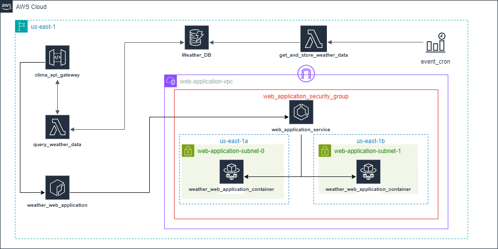

# TFM: GeoVerificationSystem

En este repositorio se recopila todo el código desarrollado para el Trabajo Final de Máster del Máster de Ciencia de Datos e Ingeniería de Datos en la Nube.

Se despliega toda una infraestructura en `AWS` para crear un sistema de verificación de datos geoespaciales:

- Se crea una `Lambda` que realiza peticiones a una `API` de datos meteorológicos cada dos horas para procesarlos y almacenarlos en una tabla de `DynamoDB`.

- Se despliega una `API Gateway` con dos recursos (`GET /clima` y `GET /clima/{provincia}`) e integrada con otra `Lambda` para que se puedan consultar los datos almacenados en la tabla de `DynamoDB` mediante dicha API.

- Por último, se crea una aplicación web con `Streamlit` para mostrar los datos de forma gráfica en un mapa, además de visualizaciones de los datos con `Seaborn`. Esta aplicación se conteneriza creando una imagen de `Docker` para subirla a `ECR` y desplegarla mediante un servicio de `ECS` con `Fargate`, realizando la configuración de red (subredes, grupo de seguridad, puerta de enlace de internet, etc) mediante `VPC`.

Se realiza `linting` del código de Python, se ejecutan tests unitarios y se realiza el aprovisionamiento de toda la infraestructura de `AWS` con `Terraform` mediante un proceso de `CI/CD` con `GitHub Actions`.

## Estructura

- **.github**: Directorio donde se recopilan los `YAML` que se encargan de definir los flujos de `CI/CD` de `Github Actions`. En el proceso de integración continua se realiza `linting` del código de `Python` y en el proceso de despliegue continuo se ejecuta el aprovisionamiento de la infraestructura de `AWS` mediante `Terraform`.

- **img**: Carpeta para recopilar imágenes.

- **infra**: En esta carpeta se recopilan todos los archivos de configuración de `Terraform` desarrollados con `HCL` y estructurados en módulos y los recursos como `layers` y códigos de las `Lambda` en `.zip`.

- **src**: Directorio donde se almacenan los códigos de `Python` desarrollados para las funciones `Lambda` así como para la aplicación web de `Streamlit`.

- **test**: Carpeta donde se almacenan los tests unitarios creados de las funciones de `Python`.